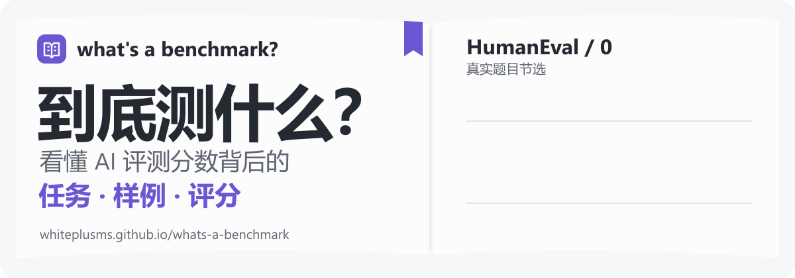
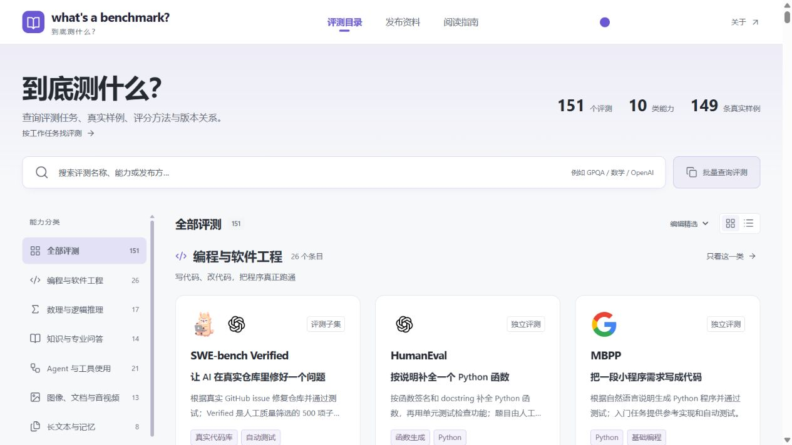

# what's a benchmark? · 到底测什么？

**看懂 AI 评测任务、真实样例和评分含义。**

[English](README.md) · 简体中文 · [静态封面](assets/readme/hero.svg)

**在线访问：** [https://whiteplusms.github.io/whats-a-benchmark](https://whiteplusms.github.io/whats-a-benchmark)

  

## 页面预览

## 项目简介

「到底测什么？」把 AI 评测介绍、任务样例、评分方法和官方资料整理在一起，帮助读者理解模型发布报告中的评测名称与分数，了解模型需要完成什么任务，以及不同版本有什么区别。

网站目前使用**简体中文**，原始任务材料保留来源语言，由本站提供解读。阅读无需登录。

## 主要功能

- **查找评测**：按名称、能力或发布方搜索，按分类浏览，也可以粘贴模型报告中的一组名称。
- **理解任务**：了解模型接收什么输入、需要交付什么，以及评测考察哪些能力。
- **查看样例**：阅读真实任务、明确标注的节选和本站解读。文本、代码、图片、音频及参考答案是否提供，以具体条目为准。
- **读懂分数**：了解指标如何计算、哪些评测条件影响结果，以及分数的适用范围。
- **比较评测**：把两到三项评测放在一起，比较任务、能力范围、局限和版本关系。
- **追溯来源**：通过阅读指南与模型发布资料，继续查阅官方论文、项目主页和数据集。

目录覆盖编程、数理与逻辑推理、知识问答、Agent 与工具使用、多模态理解、长上下文、指令遵循、真实工作、写作与设计，以及综合评测。

## 使用方式

1. 打开[网站](https://whiteplusms.github.io/whats-a-benchmark)，搜索评测名称或按能力分类浏览。
2. 打开评测详情，阅读任务说明、查看可用样例，了解评分方法。
3. 选择两到三项相关评测，比较它们的任务和评测条件。
4. 沿着来源链接查看原始资料，或通过阅读指南继续了解评测。

## 资料来源

内容依据评测发布者的论文、项目主页、官方仓库和数据说明整理。模型发布报告用于了解评测的采用情况和已报告的结果。

原始材料、节选和本站解读分别标注。各条目会说明样例获取情况，部分条目提供官方入口及获取说明。

## 参与贡献

欢迎通过 [GitHub Issues](https://github.com/WhitePlusMS/whats-a-benchmark/issues) 纠正解释、补充评测或提供更准确的资料。反馈时请注明评测名称、需要补充或修正的内容，以及对应的官方来源链接。

项目由 [WhitePlusMS](https://github.com/WhitePlusMS) 维护。
